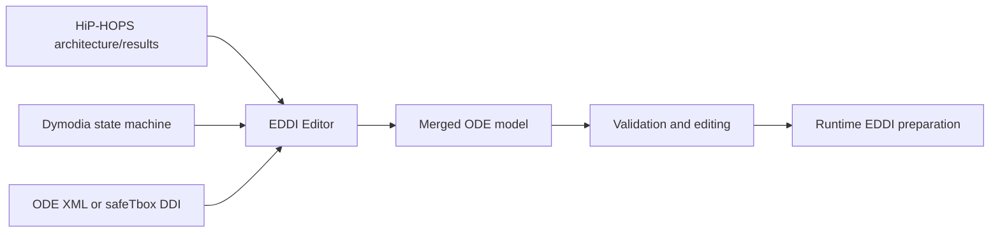

# EDDI Editor

<div class="hero" markdown>

**A practical bridge between safety analysis tools and runtime EDDI generation.**

EDDI Editor imports safety and state-machine models, converts them into ODE representations, lets engineers inspect and edit the merged structure, and prepares models for downstream runtime EDDI tooling.

[Get Started](#build-and-run){ .md-button .md-button--primary }
[View Repository](https://github.com/Dependable-Intelligent-Systems-Lab/EDDI-Editor){ .md-button }

</div>


EDDI Editor is designed as a glue tool. It is useful when model evidence already exists in other tools, but you need a common ODE-based representation that can be edited, merged, validated, and prepared for runtime EDDI use.

!!! tip "Use EDDI Editor as an integration step"
    Build or analyze models in their specialist tools first. Then use EDDI Editor to import, convert, merge, inspect, and prepare the combined ODE model for downstream processing.

## Key Features

<div class="grid cards" markdown>

- **Convert safety models**

    Import HiP-HOPS architecture and analysis outputs, including FMEA and FTA information, and convert them into ODE models.

- **Convert state machines**

    Import Dymodia state machines and standalone JSON state machines, then map them into ODE state-machine structures.

- **Edit and merge ODE models**

    Load ODE XML or safeTbox DDI files, edit common entity properties, replace placeholder subsystems, and add imported failure models.

- **Validate integration issues**

    Run simple checks for model consistency, such as disconnected causes, triggers, and deviations.

</div>

## Supported Tasks and Modes

| Task | Main project | Typical input | Output or result |
| --- | --- | --- | --- |
| Open and edit an ODE model | `ODEConverter` | ODE XML, DDI | Editable ODE model |
| Convert HiP-HOPS to ODE | `ODELib`, `ODEConverter` | HiP-HOPS architecture XML and results XML | ODE system, FMEA, and fault-tree data |
| Convert Dymodia to ODE | `ODELib`, `ODEConverter` | Dymodia `.usm` or `.uproj` files | ODE state machine |
| Import a subsystem | `ODEConverter` | ODE, HiP-HOPS, or Dymodia model | New or replacement subsystem |
| Test conversion code | `ODEConverterConsole` | Local example models | Console conversion experiment |
| Visualize runtime behavior | `SESAME_Sim` | ODE/DDI-derived visualizer inputs | Godot-based SESAME simulation |

## Model Formats

| Format | Direction | Notes |
| --- | --- | --- |
| HiP-HOPS XML | Import to ODE | Supports architectures and analysis results such as FMEA and FTA data. |
| Dymodia state machines | Import to ODE | Converts Dymodia state-machine models into ODE state machines. |
| ODE XML | Open, edit, merge, save | Native working representation for system, failure, FMEA, fault-tree, and state-machine data. |
| safeTbox DDI | Import to ODE | Loaded through the `DDI_Importer` class. |
| Standalone JSON state machines | Import to ODE | Loaded through `StandaloneStateMachineImporter`. |

## Workflow



1. Create or analyze source models in the specialist tool.
2. Open EDDI Editor and import the relevant model files.
3. Convert non-ODE models into ODE.
4. Merge subsystems, state machines, and failure models into the target ODE structure.
5. Edit properties and run the available validation checks.
6. Save the merged ODE model for downstream processing.

## Build and Run

EDDI Editor is a Windows desktop solution targeting **.NET Framework 4.7.2**.

### Requirements

- Windows
- Visual Studio 2022 or newer
- .NET Framework 4.7.2 developer tools
- NuGet package restore enabled
- Godot 4.2 or newer, only for the optional `SESAME_Sim` visualizer

### Build the Desktop Editor

```powershell
git clone https://github.com/Dependable-Intelligent-Systems-Lab/EDDI-Editor.git
cd EDDI-Editor
start ODEConverter.sln
```

In Visual Studio:

1. Restore NuGet packages if prompted.
2. Build the solution.
3. Start the `ODEConverter` project to use the WPF editor.

### Project Layout

| Path | Purpose |
| --- | --- |
| `ODELib/` | Conversion and data-model library for ODE, HiP-HOPS, Dymodia, DDI, and standalone JSON state machines. |
| `ODEConverter/` | WPF GUI using MVVM view models over `ODELib`. |
| `ODEConverterConsole/` | Console project for conversion experiments and importer testing. |
| `SESAME_Sim/` | Godot/C# SESAME visualizer project. |
| `Example models/` | Small demo models for HiP-HOPS, Dymodia, ODE, DDI, and JSON state machines. |
| `Documentation/` | Existing PDF/DOCX user guide files and ODE meta-model resources. |

## Usage Examples

### Convert a HiP-HOPS Model in Code

`ODELib` can be used independently of the GUI. A typical conversion flow loads a HiP-HOPS model, optionally merges analysis results, and passes the model to a converter.

```csharp
using ODELib;
using ODELib.hip;
using ODELib.ode;

var converter = new ConverterHIPtoODE();
ode.Model odeModel = converter.ConvertHIPtoODE(hipModel);
```

### Import a DDI File

```csharp
using ODELib;

var importer = new DDI_Importer();
var model = importer.ImportFromDDI("SESAME_DDI_example.ddi");
```

### Standalone JSON State Machine

The standalone JSON importer expects a named state machine with states, transitions, optional state positions, colors, entry actions, start state flags, fail state flags, and semicolon-separated transition triggers.

```json
{
  "name": "Primary Standby",
  "states": [
    {
      "name": "Primary",
      "position": [100, 100],
      "colour": [0.1, 0.6, 0.8],
      "start": true,
      "fail": false,
      "onentry": []
    }
  ],
  "transitions": [
    {
      "name": "switch_to_standby",
      "from": "Primary",
      "to": "Standby",
      "trigger": "primary_failed"
    }
  ]
}
```

## Example Models

The `Example models/` folder includes a small standby-recovery scenario and supporting model variants:

| Example | Description |
| --- | --- |
| `hip_standbyRecoveryFull_Analysis.xml` | Full HiP-HOPS architecture model. |
| `hip_standbyRecovery_Results.xml` | HiP-HOPS analysis results for the standby-recovery example. |
| `hip_standbyRecoveryEmptyStandby_Analysis.xml` | Architecture with a placeholder standby subsystem. |
| `hip_standbyRecoveryOnlyStandby_Analysis.xml` | Standalone standby subsystem for replacement or merge testing. |
| `dym_PrimaryStandbySM.uproj` | Dymodia project containing the state-machine model. |
| `ode_standbyRecoveryFull.xml` | ODE export of the full model. |
| `ode_standbyRecoveryWithSM.xml` | ODE model with an imported state machine. |
| `SESAME_DDI_example.ddi` | DDI example from safeTbox. |
| `standalone_sm.json` | Minimal standalone JSON state-machine example. |

## Editor Concepts

### Main Window

The WPF editor can create an empty ODE model, open an existing ODE model, import and convert source models, save the current ODE model, and run the available validation command.

### Importing and Merging

Context-menu import operations let you:

- Import a model as a new subsystem.
- Import a model and replace the selected subsystem.
- Import a failure model into the selected system.

This is useful for starting with a high-level ODE architecture and filling placeholders with richer subsystem or failure-model data from HiP-HOPS, Dymodia, or another ODE file.

### MVVM Structure

`ODEConverter` keeps UI concerns in WPF windows and view models, while `ODELib` contains the data structures, serialization behavior, and conversion logic. This makes `ODELib` usable from the GUI, the console project, or other .NET tools.

## Known Limitations

!!! warning "Current scope"
    EDDI Editor is not intended to replace specialist modeling or safety-analysis tools. It is primarily a conversion, editing, and integration utility.

- `ConverterODEtoHIP` is a limited prototype.
- `Export As` is marked as in progress in the GUI.
- `Validate model` performs only limited checks and is still unfinished.
- Some ODE members are not represented yet, including several hazard, port, transition-matrix, and system details.
- Runtime EDDI generation may still require additional post-processing after export.

## FAQ

### Is EDDI Editor a modeling tool?

No. It is intended as an integration and conversion tool. Models should normally be created or analyzed in dedicated tools before they are imported into EDDI Editor.

### Can I use the converter without the GUI?

Yes. `ODELib` is independent of the WPF application and can be referenced directly from other .NET code.

### Which project should I run?

Run `ODEConverter` for the desktop editor. Use `ODEConverterConsole` when you want a small console harness for importer or converter experiments.

### Can it import DDI files?

Yes. DDI files can be loaded through the safeTbox DDI importer and represented as ODE models.

### Does the SESAME visualizer build with the main solution?

No. `SESAME_Sim` is a separate Godot/C# project and requires Godot 4.2 or newer.
